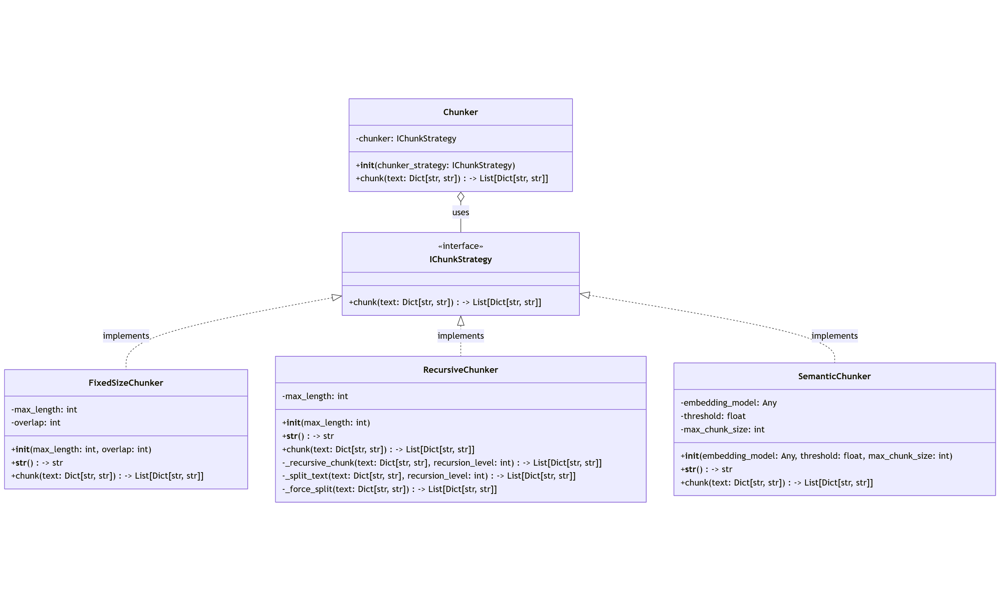
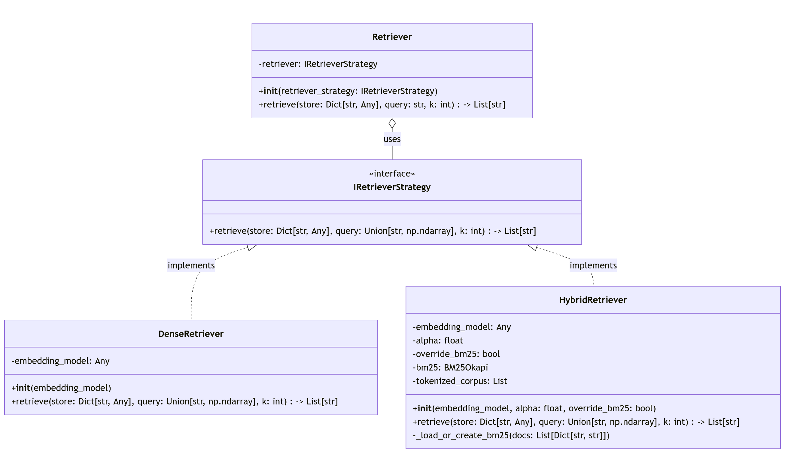
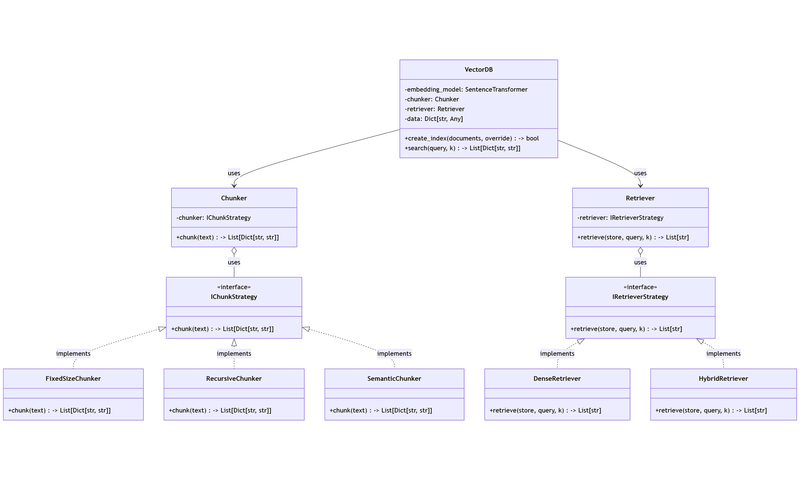
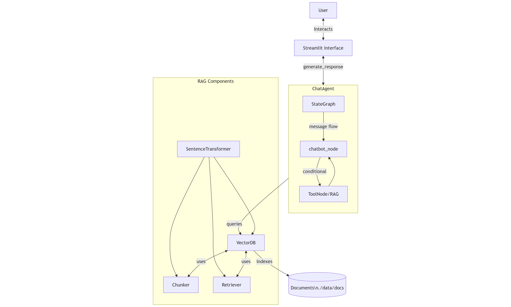

# RAG-Agent 🚀

RAG-Agent is a modular and efficient framework designed to build Retrieval-Augmented Generation (RAG) systems. It combines components like chunkers, retrievers, and vector databases to create a seamless workflow for intelligent agents.

## Project Overview 📖

The RAG-Agent framework is composed of three main components:

1. **Chunker**: Responsible for splitting large documents into smaller, manageable chunks.
   

2. **Retriever**: Retrieves the most relevant chunks based on a query.
   

3. **Vector Database (VectorDB)**: Stores and indexes the document embeddings for efficient retrieval.
   

The workflow of the RAG-Agent integrates these components to process queries and generate responses:


## Theoretical Background 📚

RAG (Retrieval-Augmented Generation) combines the generative capabilities of large language models (LLMs) with information retrieval systems to produce accurate, up-to-date, and verifiable responses. It operates in two main phases:

1. **Retrieval Phase**: Relevant documents or chunks are retrieved from a knowledge base.
2. **Generation Phase**: Retrieved documents are used as context for the language model to generate responses.

This hybrid approach addresses limitations of LLMs, such as static knowledge and hallucinations, by incorporating external, dynamic information.

## Features ✨

- Modular design for easy customization.
- Efficient chunking and retrieval mechanisms.
- Scalable vector database integration.
- Workflow optimized for RAG-based systems.
- Interactive web interface powered by Streamlit.

## Technologies Used 🛠️

- **FAISS**: Efficient similarity search and clustering of dense vectors.
- **Sentence-Transformers**: Semantic embeddings for queries and documents.
- **OpenAI Models**: Advanced language models for response generation.
- **LangGraph**: Orchestration of conversational flows.
- **NumPy**: Efficient handling of vector data.
- **Streamlit**: Interactive web interface for user interaction.

## Installation 🛠️

Follow these steps to set up the project:

1. Clone the repository:
   ```bash
   git clone https://github.com/migue8gl/RAG-Agent.git
   cd RAG-Agent
   ```

2. Install dependencies:
   ```bash
   pip install -r requirements.txt
   ```

3. Set up environment variables:
   Create a `.env` file in the root directory with the following variables:
   ```
   OPENAI_API_KEY=your_api_key_here
   MODEL=gpt-4o
   ```

## Usage 🚀

1. **Prepare Documents**:
   Place the files you want to index in the vector database under the `data/docs` directory:
   ```
   data/docs/
   ├── document1.txt
   ├── document2.pdf
   └── ...
   ```

   If a vector database already exists and you want to start fresh, delete the existing database file (e.g., `data/db.pkl`):
   ```bash
   rm -f data/db.pkl
   ```

2. **Run the Agent**:
   ```bash
   streamlit run chat_app.py
   ```

3. **Access the Web Interface**:
   Open your browser and navigate to `http://localhost:8501` to interact with the chatbot.

4. **Customize Components**:
   Modify the configuration files to adjust chunker, retriever, or vector database settings.

5. **Test Queries**:
   Use the provided API or CLI to send queries and receive responses.

## Troubleshooting 🛠️

- **Issue**: The agent fails to initialize.
  - **Solution**: Ensure all required environment variables are set and dependencies are installed.

- **Issue**: No results are retrieved for queries.
  - **Solution**: Verify that the vector database is populated with embeddings.

- **Issue**: The web interface does not load.
  - **Solution**: Check if Streamlit is running on the correct port (`8501` by default).

## License 📜

This project is licensed under the MIT License. See the `LICENSE` file for details.

---
Happy coding! 💻✨
